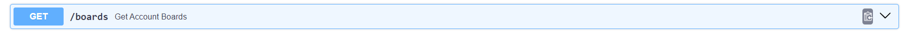

# TrelloAPI example with FastAPI

This project has been developed using Python 3.11.4, FASTAPI, and Pip.

## Getting Started

### Prerequisites

Before you begin, make sure you have the following installed on your system:

- Python 3.11
- Python's virtual environment (venv)
- Chocolatey (for Windows) (Optional for use Make see the note below)

### Setting Up the Environment

#### For Linux/MacOS

1. Open your terminal.
2. Clone this repository and navigate to the project folder:

   ```bash
   git clone https://github.com/BertiRean/trello-fastapi-example
   cd trello-fastapi-example
   ```
   
3. Create and activate a Python virtual environment:

   ```bash
   python3 -m venv .venv
   source .venv/bin/activate
   make local && make install && make run
   ```
   
5. The server will be running at [http://127.0.0.1:8000](http://127.0.0.1:8000).

#### For Windows

1. Open your command prompt or PowerShell.
2. Clone this repository and navigate to the project folder:

   ```powershell
   git clone https://github.com/BertiRean/trello-fastapi-example
   cd trello-fastapi-example
   ```
   
3. Create a virtual environment for Python in the project folder:
   ```powershell
   python3 -m venv .venv
   ```
4. Activate the virtual enviroment
    ```
      .\.venv\Scripts\activate.bat
    ```

5. Install dependencies
    ```powershell
    pip install -r requirements.txt
    ```

## How to use make command in Windows?
1. Install Chocolatey package manager following the [choco docs](https://chocolatey.org/install#individual).
   
2. Install the `make` package using Chocolatey:

   ```powershell
   choco install make
   ```

3. Now you can use make commands from Makefile normally in your powershell,  try with.

    ```powershell
    make install
    ```

## Running the Project

Now that you have set up the environment, you can start the project:

1. Make sure your virtual environment is activated.

2. Set  the Enviroment variables from .env_local file based in your Trello config and rename the file to .env

    ```bash
    TRELLO_API_KEY=""
    TRELLO_API_SECRET=""
    TRELLO_TOKEN=""
    ```

2. Run the project with the following command:

   ```bash
   cd app && uvicorn app.main:app --reload
   ```

3. You can run the tests using
    ```bash
    make test
    ```

4. The server will be accessible at [http://127.0.0.1:8000](http://127.0.0.1:8000).

5. The last Env variable ```TRELLO_BOARD_ID``` can be setted using one of the values returned by the endpoint of get account boards. Go to [http://127.0.0.1:8000/docs](http://127.0.0.1:8000/docs). And Try out with this

    
